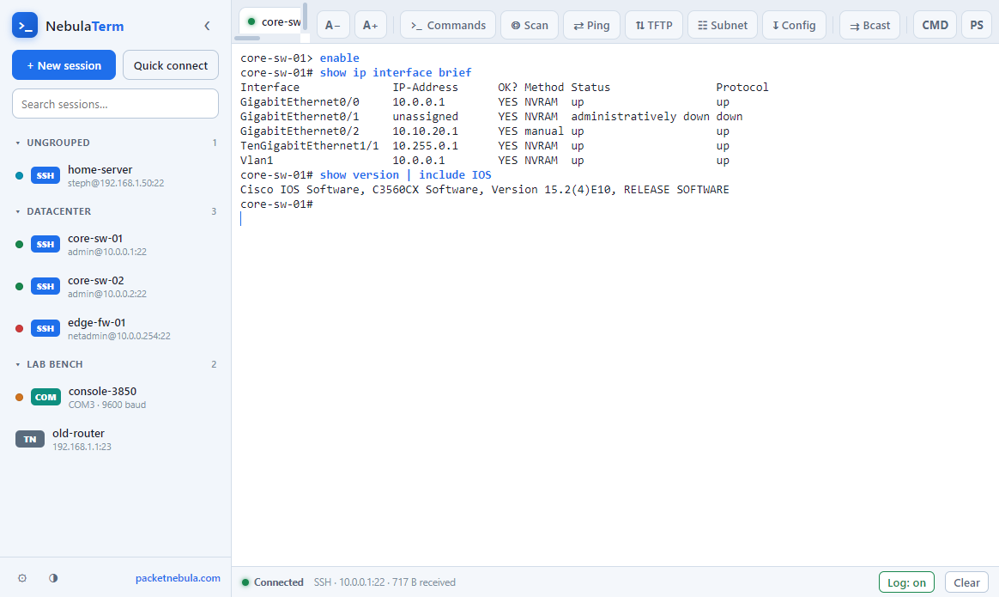
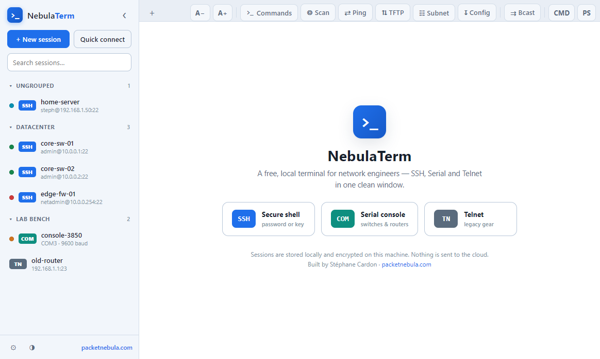
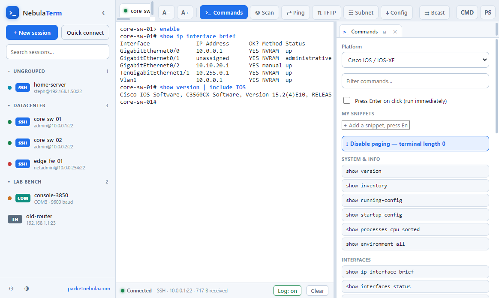
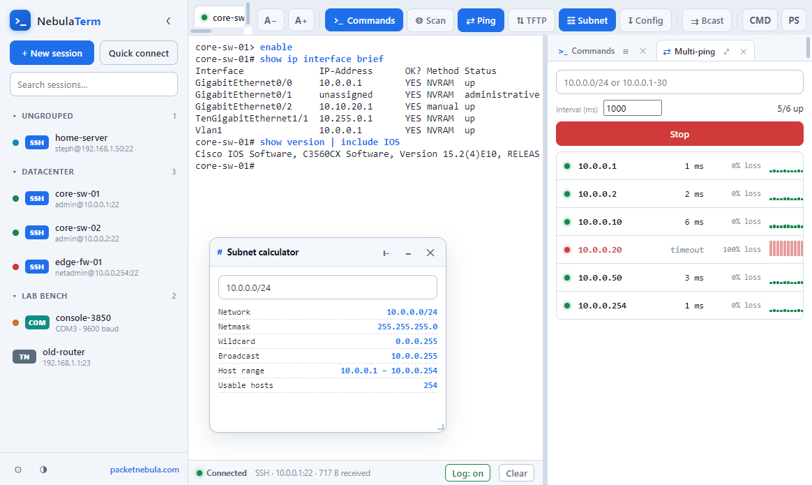

<div align="center">

# NebulaTerm

### A free, modern, local terminal for network engineers — SSH, Serial and Telnet in one clean window.

**The free, local terminal that does SSH, serial and Telnet properly in one window** — with the serial console as a first‑class citizen. No cloud. No account. No subscription. Your sessions never leave your machine.

[](LICENSE)


*Built by [Stéphane Cardon](https://packetnebula.com) · more free network tools at [packetnebula.com](https://packetnebula.com)*



</div>

---

## Why NebulaTerm?

If you configure switches, routers and firewalls, the free terminal you reach for is probably dated, the powerful one costs money for professional use, and the modern one pushes your sessions to the cloud. NebulaTerm is the missing piece:

- **Free and open‑source** (MIT) — no licence, no account, no subscription.
- **Local and private** — nothing ever leaves your machine, and credentials are encrypted on disk.
- **Modern** — tabs, light/dark themes, in‑terminal search, a real session manager.
- **SSH _and_ serial _and_ Telnet** done properly in the *same* app, with the serial console as a first‑class citizen.

That's the whole pitch — and it's what network engineers actually want.

## Features

- 🔌 **SSH, Serial (COM) and Telnet** in one unified client. The serial console for configuring switches and routers is a first‑class feature, not an afterthought.
- 🔑 **SSH with password _or_ private key** (OpenSSH keys, with passphrase support).
- 🧱 **Connects to legacy gear.** A broad algorithm set (optional per session) lets you reach old IOS/HP devices that modern clients refuse — `diffie-hellman-group1-sha1`, `ssh-rsa`, `aes-cbc`, and friends.
- 🗂️ **Real session manager** — folders, tags, instant search, one‑click connect.
- 🔐 **Credentials encrypted at rest** with the OS keystore (DPAPI / Keychain / libsecret). Never stored in plain text.
- 🧭 **Tabs** — keep many devices open side by side.
- 📝 **Automatic session logging** to a file, with optional clean (color‑stripped) output — perfect for capturing a running‑config.
- 🧵 **Many sessions at once** — open as many SSH / Telnet / serial tabs as you like; they run in parallel and stay alive (SSH and Telnet keepalive).
- ⇉ **Broadcast typing** — push the same command to **every connected session at once** (bulk config across a stack of switches).
- 🔁 **Auto-reconnect** — a dropped session reconnects on its own (with a cancellable countdown); great for flaky links and rebooting gear.
- 🎨 **Colour-tag your sessions** and save your own **command snippets** — recognise devices at a glance and keep your go-to commands one click away.
- 💾 **Import / export sessions** — back up your session list or move it to another machine (JSON, passwords excluded).
- 🔁 **Serial port control** — an **Open / Close port** button right in the status bar frees a COM port left stuck by an unplugged adapter or a wild disconnect, without restarting the app.
- 🛟 **Safety nets** — NebulaTerm warns you before quitting while sessions are still connected, and destructive vendor commands are never auto‑run.
- 🎨 **Light & dark themes**, adjustable monospace font, block/bar/underline cursor.
- 🖱️ **Quality‑of‑life**: copy‑on‑select, right‑click paste, in‑terminal search (`Ctrl+F`), clickable links, Quick Connect.
- 📟 **Vendor command cheat‑sheet** — one click types the right command for the platform you're on: Cisco IOS/NX‑OS `show…`, HPE Aruba & Comware and Huawei `display…`, Juniper, Arista, MikroTik, Linux. Set a vendor on a session and the panel follows it. Destructive commands (`reload`, `write erase`…) are flagged and never auto‑run.
- 🧰 **Built‑in network toolbox** — tools **dock on the right beside your terminal** (never hiding it), several open at once as tabs, and each network tool can **pop out into its own window you can drag to a second monitor**. They keep running in the background while you work:
  - **TFTP server** — back up / restore switch configs and push IOS images (`copy … tftp://<your-ip>/file`).
  - **Multi‑ping** — live, continuous ping of a whole `CIDR` / mask / range, with a **per‑host latency sparkline**, packet loss, stop anytime.
  - **IP scanner** — one‑shot ICMP + TCP port sweep of a range (no admin needed), live results, reverse DNS.
  - **Subnet calculator** — network / mask / wildcard / broadcast / host range, feed straight into the scanner.
  - **Send config file** — paste a `.cfg` **line‑by‑line with a delay** (no more drops on a 9600‑baud console) and it watches the reply for `% Invalid` errors so you know it loaded clean.
- 🎨 **Readable sessions** — the **commands you type are highlighted in blue** (toggle in Settings) so they stand out from the device's output.
- 🪟 **All in one window** — local **CMD** and **PowerShell** one click away, font size **A− / A+** buttons, and right‑click paste just like the tools you already use.
- 🛡️ **100% local. Zero telemetry.** Nothing is ever sent to a server. This is the whole point.

<div align="center">



</div>

## Built‑in toolbox

No more juggling tftpd32, a ping window, a subnet calculator in a browser tab and a notes file of vendor commands — it's all in the same window, as **floating panels you can open at once and drag anywhere**.

| Vendor command cheat‑sheet | Docked & detachable tools (TFTP · multi‑ping · scanner · subnet · config‑send) |
| :---: | :---: |
|  |  |
| Click a command to drop it into the active session. The panel auto‑selects the session's vendor (`show` vs `display` vs Junos vs MikroTik…). | Tools dock beside the terminal as tabs (it stays visible), or pop out into movable windows — here multi‑ping with its live sparkline docked on the right and the subnet calculator detached. |

## Download

Grab the latest **Windows** build from the [Releases](../../releases) page:

- **64‑bit (recommended)** — `NebulaTerm-Setup-x.y.z-x64.exe` (installer) or `NebulaTerm-x.y.z-x64-portable.exe` (single portable exe, no install — great for a USB stick in the network cupboard).
- **32‑bit** — `NebulaTerm-Setup-x.y.z-ia32.exe` / `NebulaTerm-x.y.z-ia32-portable.exe`, for the few older 32‑bit Windows machines still around.

> **Windows SmartScreen note:** the build is not code‑signed yet, so Windows may show a *"Windows protected your PC"* prompt the first time. Click **More info → Run anyway**. The source is right here if you'd rather build it yourself.

Linux and macOS builds can be produced from source (see below); Windows is the priority target because that's where the serial console matters most.

## Test drive — no hardware needed

NebulaTerm ships with a **device lab**: simulated Cisco‑style devices you can connect to over **Telnet *and* SSH**, so you can try everything without a switch on your desk.

```bash
npm run lab          # or double-click lab.bat on Windows
```

It starts two devices on localhost:

| Device | Telnet | SSH |
| --- | --- | --- |
| `core-sw-01` (switch) | `127.0.0.1:2323` | `127.0.0.1:2222` |
| `edge-rtr-01` (router) | `127.0.0.1:2324` | `127.0.0.1:2223` |

In NebulaTerm, **Quick Connect → Telnet `127.0.0.1` port `2323`** (SSH login: any username / any password). Then try `enable`, `show ip interface brief`, `show running-config`, or click commands from the **Commands** panel. Open several tabs to see parallel sessions; close the lab with `Ctrl+C`.

## Build from source

```bash
git clone https://github.com/Apoale33/nebulaterm.git
cd nebulaterm
npm install
npm start            # run the app

npm run smoke        # headless engine self-test (ssh2 / serialport / crypto / telnet)
npm run dist         # build the Windows installer + portable exe into release/
```

Requires Node.js 18+. The serial binding (`serialport`) ships prebuilt N‑API binaries, so **no native compiler is needed** on common platforms.

## Usage

**Create a session** — click **+ New session**, pick **SSH / Serial / Telnet**, fill in the details, optionally drop it in a folder, then **Save & connect**. Saved passwords and key passphrases are encrypted by your operating system's keystore.

**Quick Connect** — `Ctrl+Shift+N` to connect once without saving anything.

**Serial console** — choose **Serial**, hit ↻ to list COM ports, pick your baud rate (9600 is the default for most console ports), and you're on the box.

### Keyboard shortcuts

| Action | Shortcut |
| --- | --- |
| New session | `Ctrl+N` |
| Quick Connect | `Ctrl+Shift+N` |
| Close tab | `Ctrl+W` |
| Copy / Paste | `Ctrl+Shift+C` / `Ctrl+Shift+V` |
| Find in terminal | `Ctrl+F` |
| Toggle light/dark | `Ctrl+T` |
| Font size | `Ctrl+=` / `Ctrl+-` |
| Settings | `Ctrl+,` |

## Security & privacy

NebulaTerm is built for people who take this seriously:

- **Local only.** No cloud sync, no account, no analytics, no phone‑home. Ever.
- **Encrypted credentials.** Passwords and passphrases are sealed with the OS keystore (Windows DPAPI, macOS Keychain, Linux libsecret) and stored as ciphertext in your user profile. If secure storage isn't available, NebulaTerm simply won't write secrets to disk and asks at connect time instead.
- **Open source, MIT.** Read every line. Build it yourself.

## Roadmap

Kept deliberately tight for v1. Likely next:

- SFTP / file transfer
- SSH tunnels & port forwarding
- Saved snippets / command broadcast to multiple tabs
- Signed Windows installer

Issues and PRs are welcome — please keep the scope focused on doing SSH + serial + Telnet *really well*.

## Built with

[Electron](https://www.electronjs.org/) · [xterm.js](https://xtermjs.org/) · [ssh2](https://github.com/mscdex/ssh2) · [node-serialport](https://serialport.io/)

## Author

**Stéphane Cardon** — network & cybersecurity engineer. I build free tools for network and sysadmin work at **[packetnebula.com](https://packetnebula.com)** — subnet calculators, MAC/OUI lookup, DNS & TLS checkers, and more. If NebulaTerm saves you time, a look around the site is the nicest thank‑you.

## License

[MIT](LICENSE) © 2026 Stéphane Cardon

---

<div align="center"><sub>

**open source ssh client · serial console software · com port terminal · telnet client · network engineer terminal · ssh and serial in one app · free tftp server · local ssh session manager**

</sub></div>
